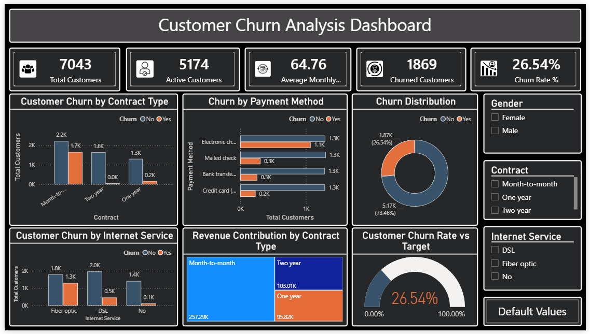
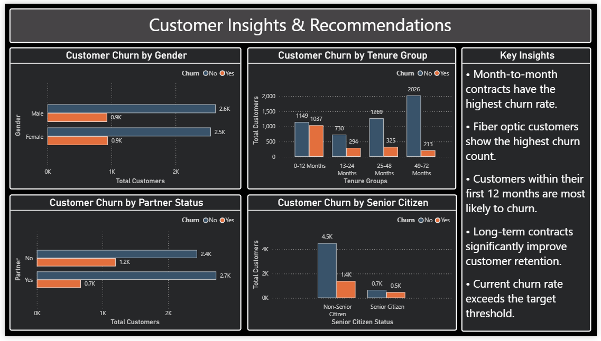

# Customer Churn Analysis

## Dashboard Preview

### Executive Dashboard

### Customer Insights & Recommendations

## Project Overview

This project analyzes customer churn data from a telecom company to identify key factors influencing customer retention and churn. The analysis was performed using Python, SQL, and Power BI.

## Dataset

The dataset contains telecom customer information including demographics, account details, services subscribed, billing information, and customer churn status. The dataset consists of 7,043 customer records and 21 features.

## Tools & Technologies

- Python
- Pandas
- Matplotlib
- SQL (SQLite)
- Power BI
- Data Cleaning
- Exploratory Data Analysis (EDA)
- Data Visualization

## Project Objectives

* Analyze customer churn patterns
* Identify factors contributing to customer attrition
* Generate business insights for customer retention
* Build an interactive Power BI dashboard

## Key Metrics

- Total Customers: 7,043
- Churned Customers: 1,869
- Active Customers: 5,174
- Churn Rate: 26.54%
- Average Monthly Charges: 64.76

## Key Insights

* Month-to-month contracts have the highest churn rate.
* Fiber optic customers show the highest churn count.
* Customers within their first 12 months are more likely to churn.
* Long-term contracts significantly improve customer retention.
* Current churn rate exceeds the target threshold.

## Project Structure

Customer-Churn-Analysis/
│
├── Dashboard/
├── Data/
├── Images/
├── Notebooks/
├── SQL/
├── README.md
└── requirements.txt

## Dashboard Pages

### Executive Dashboard

* KPI Cards
* Churn by Contract Type
* Churn by Internet Service
* Churn by Payment Method
* Revenue Treemap

### Customer Insights & Recommendations

* Churn by Tenure Group
* Churn by Gender
* Churn by Partner Status
* Churn by Senior Citizen Status
* Key Business Insights

## Future Improvements

- Build a machine learning model to predict customer churn.
- Deploy the dashboard using Power BI Service.
- Automate data refresh and reporting.
- Perform advanced customer segmentation analysis.

## Author

Kunal Ubhare

Aspiring Data Analyst | Python | SQL | Power BI
